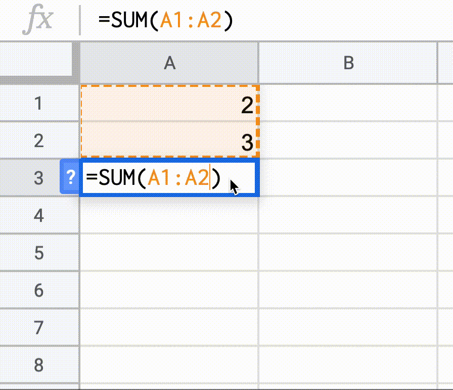

<p align="center">
  
</p>

> The ~~science~~ that deals with the [properties](https://developer.mozilla.org/en-US/docs/Web/JavaScript/Guide/Working_with_Objects#objects_and_properties), [composition](https://v3.vuejs.org/guide/composition-api-introduction.html#why-composition-api), and structure of states, the transformations they undergo during [reactions](https://v3.vuejs.org/guide/reactivity.html#what-is-reactivity).

Reactified JavaScript functions for Vue, powered by [`reactify`](https://vueuse.js.org/?path=/story/utilities--reactify) from [VueUse](https://github.com/antfu/vueuse).

## Reactified? What?

In JavaScript, for most of the time, you are dealing with procedural functions. Which means after the result calculation won't have relationships with its sources, for example

```js
function sum(x, y) {
  return x + y
}

let a = 1
let b = 2

let c = sum(a, b) // c = a + b = 3

a = 2

console.log(c) // still 3, not 4
```

On the other hand, in Spreadsheets apps like Microsoft Excel or Google Sheets, formulas are always up-to-update whenever their source changes.

</video>

[Vue's reactivity system](https://v3.vuejs.org/guide/reactivity.html#what-is-reactivity) is a way to approach the reactiveness in JavaScript. In the [Composition API](https://v3.vuejs.org/guide/composition-api-introduction.html#why-composition-api), we are kinda mixing the procedural and reactivity together. But what if you want to have a complete reactive developing experience?

**Introducing Vue Chemistry**, a set of reactified JavaScript functions letting you enjoy the pure reactiveness!

Take the example above, we can have:

```js
import { set } from 'vue-chemistry'
import { sum } from 'vue-chemistry/math'
import { log } from 'vue-chemistry/console'

const a = ref(1)
const b = ref(2)

let c = sum(a, b) // c = a + b = 3

set(a, 2)

log(c) // it's 4!
```

### Cool, but how it works?

It's basicity converting the function's arguments to accept the `Ref` in Vue and wrapper the result with `computed`. This makes it automatically collects dependency sources and re-evaluate when the sources get changed. Note that the `ComputedRef` is also a `Ref` so the operations are chainable!

An example for comparsion:

```ts
// procedural function
function sum(x: number, y: number) {
  return x + y
}
```

```ts
import { computed, unref, Ref, ComputedRef } from 'vue'

// reactified function
function sum(
  x: number | Ref<number>,
  y: number | Ref<number>
): ComputedRef<number> {
  return computed(() => unref(x) + unref(y))
}
```

If you want to convert a normal function into a "reactified" one, you can use `reactify()` function.

```ts
import { reactify } from 'vue-chemisty'

function sum(x: number, y: number) {
  return x + y
}

const reactifiedSum = reactify(sum)
```

## Install

```bash
npm i vue-chemistry
```

## Usage

Functions available in the following namespaces

```js
// see the auto-completion for the full functions list
import { sqrt, pow, sum, sin, round } from 'vue-chemistry/math'
import { toString, toLowerCase } from 'vue-chemistry/string'
import { parseInt, parseFloat } from 'vue-chemistry/number'
import { parse, stringify } from 'vue-chemistry/json'
import { isFalsy } from 'vue-chemistry/boolean'
import { log } from 'vue-chemistry/console'
```

## Example

```js
import { ref } from 'vue'
import { set } from 'vue-chemistry'
import { dec } from 'vue-chemistry/number'
import { log } from 'vue-chemistry/console'
import { stringify, parse } from 'vue-chemistry/json'
import { rs, toUpperCase } from 'vue-chemistry/string'
import { sqrt, pow, sum, multiply } from 'vue-chemistry/math'

// Math       _________
//       c = √ a² + b²
const a = ref(3)
const b = ref(4)
const c = sqrt(sum(pow(a, 2), pow(b, 2)))
log(c) // 5

set(a, 5) // shorthand for a.value =5
set(a, 12)
log(c) // 13


// JSON
//
const obj = ref({ foo:'bar' })
const str = stringify(obj)
const clone = parse(str)

log(str) // {"foo":"bar"}

obj.value.no = 42
log(str) // {"foo":"bar","no":42}

// String
//         rs - Reactive String
const name = ref('oo')
const message = rs`Hello ${toUpperCase(name)}!`
log(message) // Hello FOO!
set(name, 'Anthony')
log(message) // Hello ANTHONY!

// String 2
//
const x = ref(9)
const y = ref(9)
const z = ref(7)
const equation = rs`${x} x ${y} + ${z} = ${sum(multiply(x, y),z)}`
log(equation) //   9 x 9 + 7 = 88
set(x, 98)
dec(z)
log(equation) //  98 x 9 + 6 = 888
set(x, 987)
dec(z)
log(equation) // 987 x 9 + 5 = 8888
```

## Sponsors

This project is part of my <a href='https://github.com/antfu-sponsors'>Sponsor Program</a>

<p align="center">
  <a href="https://cdn.jsdelivr.net/gh/antfu/static/sponsors.svg">
    
  </a>
</p>

## License

MIT
